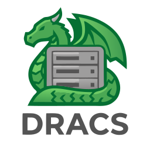
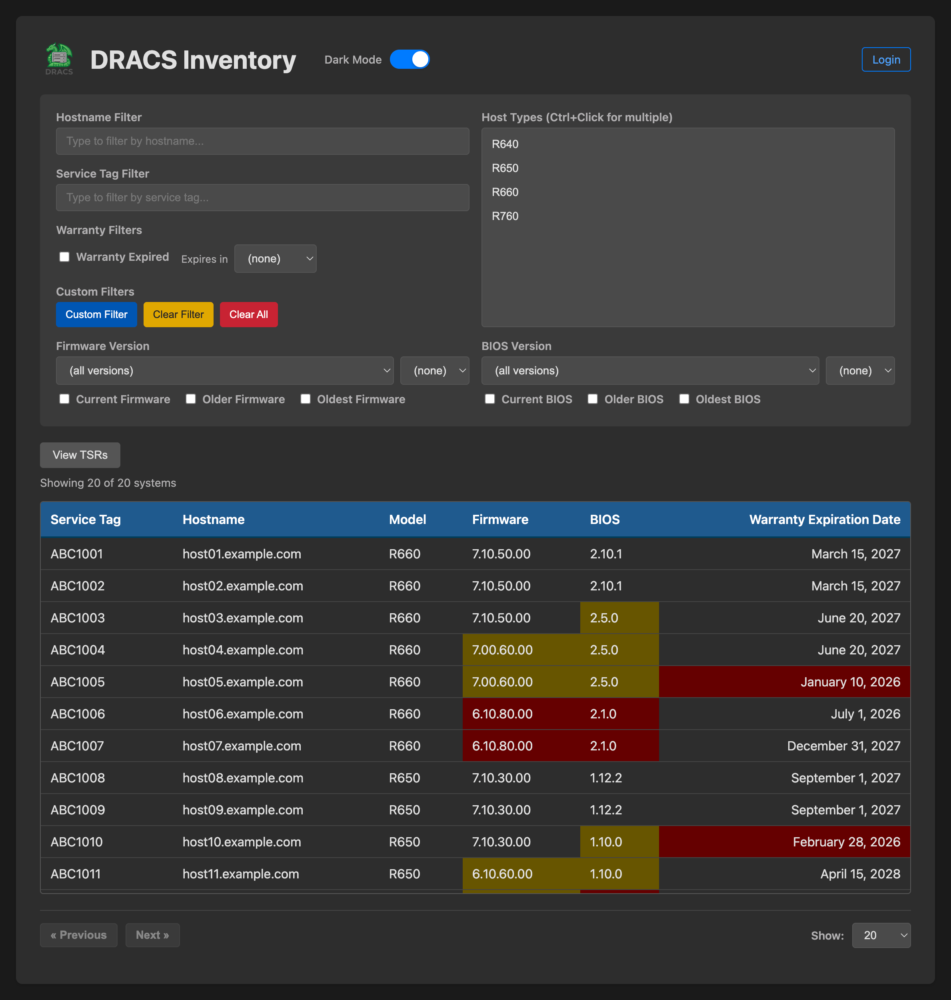
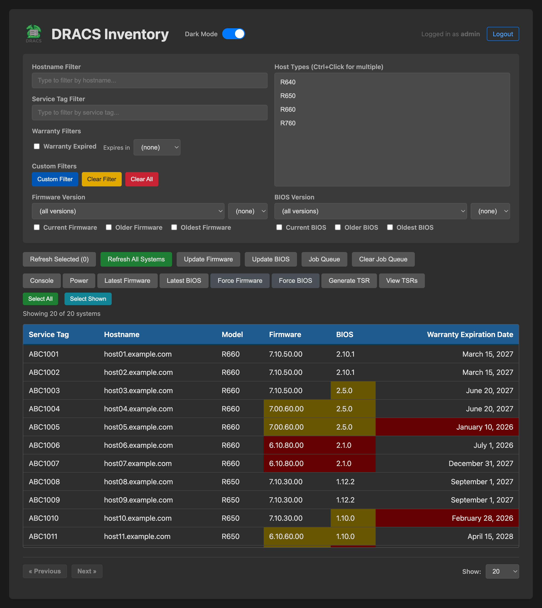

# DRACS — Dell Rack & Asset Control System

[](https://github.com/kambiz-aghaiepour/dracs/actions/workflows/run-tests.yml)
[](https://github.com/kambiz-aghaiepour/dracs/actions/workflows/semantic-release.yml)
[](https://github.com/kambiz-aghaiepour/dracs/actions/workflows/sync-back.yml)
[](https://codecov.io/gh/kambiz-aghaiepour/dracs)
[](https://app.codacy.com/gh/kambiz-aghaiepour/dracs/dashboard?utm_source=gh&utm_medium=referral&utm_content=&utm_campaign=Badge_grade)

[](https://pypi.org/project/dracs/)
[](https://www.python.org/downloads/)
[](https://www.gnu.org/licenses/gpl-3.0)



Simple, portable, self-contained dynamic CLI inventory tool for managing Dell bare-metal systems inventory, warranty and lifecycle.

- Plugs directly into Dell Support API
- Live hardware data management via SNMP
- Utilizes a portable SQLite database
- Supports regex and simple search patterns
- Easily extensible to scripting and automation
  <!--toc:start-->
  - [🚀 Features](#-features)
  - [🛠️ Prerequisites](#%EF%B8%8F-prerequisites)
  - [📦 Installation](#-installation)
    - [1. RPM Installation](#1-rpm-installation-preferred-for-fedora-43-fedora-44-and-rawhide)
    - [2. Github clone (Developer)](#2--github-clone-developer)
    - [3. Install from PyPI](#3-install-from-pypi)
  - [📖 Usage](#-usage)
    - [1. Add a New System](#1-add-a-new-system)
    - [2. Discover a System](#2-discover-a-system)
    - [3. List Inventory](#3-list-inventory)
    - [4. Lookup a Specific System](#4-lookup-a-specific-system)
    - [5. Edit a System](#5-edit-a-system)
    - [6. Refresh System Data](#6-refresh-system-data)
    - [7. Remove a System](#7-remove-a-system)
    - [Common Usage Patterns](#common-usage-patterns)
    - [8. TSR Operations](#8-tsr-operations)
    - [9. Firmware Operations](#9-firmware-operations)
    - [10. BIOS Operations](#10-bios-operations)
    - [11. iDRAC Job Queue Operations](#11-idrac-job-queue-operations)
    - [12. Job Queue Management](#12-job-queue-management)
    - [13. User Management](#13-user-management)
  - [🌐 Web Interface](#-web-interface-dracs-webapp)
  - [📡 Remote Client](#-remote-client-dracs-client)
  - [📅 Scheduled Tasks](#-scheduled-tasks)
  - [👤 User Management](#-user-management)
  - [📋 Audit Logging](#-audit-logging)
  - [⚙️ Command Reference](#-command-reference)
  - [📝 Tips & Troubleshooting](#-tips-troubleshooting)
  <!--toc:end-->

## 🚀 Features

- **Warranty Tracking:** Automatically fetches expiration dates from the Dell API using Service Tags
- **Hardware Discovery:** Uses SNMP to poll iDRAC and BIOS version information directly from the hardware
- **Data Refresh:** Update both SNMP hardware data AND warranty information for existing systems
- **Version Comparison:** List and filter systems based on version strings (e.g., find all hosts with BIOS version less than 2.1.0)
- **Flexible Output:** View inventory in a formatted grid table or export to JSON for automation
- **Web Interface:** Full-featured web UI with multi-select, firmware/BIOS updates, TSR collection, power control, and dark mode
- **Remote Client:** Lightweight `dracs-client` CLI for querying a DRACS server over HTTPS from any machine
- **Job Queue:** SQLite-backed job queue with bounded worker pool for safe batch operations (firmware updates, BIOS updates, TSR collections, refresh)
- **Scheduled Tasks:** Cron-like scheduler for automated daily/weekly TSR collection, refresh, and iDRAC job queue maintenance
- **Firmware & BIOS Management:** Download latest versions from Dell with SHA256 verification, archive originals, apply or force-apply from the CLI or web UI
- **TSR Management:** Collect, list, and download Dell Tech Support Reports from CLI or web interface
- **iDRAC Job Queue:** View and clear iDRAC job queues across hosts from CLI or web UI
- **Multi-User RBAC:** Role-based access control with admin and user roles. Admins have full access; users can access consoles, generate TSRs, view job queues, and test iDRAC connectivity
- **User Management:** Create, delete, and manage users via the web interface or CLI (`dracs user`). A bootstrap superadmin account is configured via the config file
- **Audit Logging:** All admin actions (firmware/BIOS updates, power operations, user management, etc.) are logged to `/var/log/dracs/audit.log` with timestamps, user attribution, and source IP tracking
- **RPM Packaging:** Available as `python3-dracs` (server) and `dracs-client` (remote CLI) via COPR
- **SQLite Backend:** No heavy database setup required; everything is stored in a local .db file
- **Command Aliases:** Short aliases for all commands (e.g., `a` for add, `li` for list, `t` for tsr, `j` for jobs)

## 🛠️ Prerequisites

- **Python 3.12+**
- **Dell TechDirect API Credentials:** You must have a Client ID and Secret from Dell to access warranty data
- **SNMP Enabled:** The target Dell systems must have SNMP enabled on their iDRACs (default community: public)
- **Network Access:** Ability to reach Dell iDRAC interfaces via DNS (naming convention configured via DRACS_DNS_STRING and DRACS_DNS_MODE)

## 📦 Installation

### 1. RPM Installation (Preferred for Fedora 43, Fedora 44, and rawhide)

```
sudo dnf copr enable kambiz/dracs
dnf install dracs
dnf enable --now dracs-webapp
```

### 2.  Github clone (Developer)

**Clone the repository:**

```
git clone https://github.com/kambiz-aghaiepour/dracs.git
cd dracs
```

**Install:**

**Option A: Install with [uv](https://docs.astral.sh/uv/) (from cloned repo):**

```bash
uv sync
source .venv/bin/activate
```

For development (includes pytest, black, etc.):

```bash
uv sync --group dev
source .venv/bin/activate
```

### 3. Install from PyPI

**Option B: Install with pip:**

```bash
mkdir -p ~/dracs && cd ~/dracs
python3 -m venv venv
source venv/bin/activate
pip install dracs
dracs init
```

The `dracs init` command creates example configuration files in the current directory:
- `.env.example` — environment variable template
- `drac-passwords.ini.example` — iDRAC credentials template
- `BIOS-filename.ini.example` — BIOS filename mapping template

After running `dracs init`, copy and configure the environment file:

```bash
cp .env.example .env
```

Edit `.env` with your Dell API credentials and other settings (see step 3 below).

To start the web interface, run `dracs-webapp` from the same directory as your `.env` file.

**Configure environment variables:**
Create a .env file in the root directory:

```bash
# Required: Dell TechDirect API credentials
CLIENT_ID=your_dell_client_id
CLIENT_SECRET=your_dell_client_secret

# Required: iDRAC DNS configuration
# DRACS_DNS_STRING: String to add to hostname for iDRAC FQDN
# DRACS_DNS_MODE: How to add the string ('prefix' or 'suffix')
#
# Examples:
# Prefix mode: "mgmt-" + "host01.example.com" = "mgmt-host01.example.com"
DRACS_DNS_STRING=mgmt-
DRACS_DNS_MODE=prefix
#
# Suffix mode: "host01" + "-mm" + ".example.com" = "host01-mm.example.com"
# DRACS_DNS_STRING=-mm
# DRACS_DNS_MODE=suffix

# Optional: SNMP community string (defaults to 'public')
SNMP_COMMUNITY=public

# Optional: Enable debug logging via environment (can also use -d flag)
DEBUG=false

# Flask secret key for session cookie signing (used by the web interface)
# IMPORTANT: For production, generate a secure key with:
#   python -c "import secrets; print(secrets.token_hex(32))"
FLASK_SECRET_KEY=dev-secret-key-change-in-production-12345678901234567890123456789012

# Web interface admin credentials
# Change these from the defaults for production use
WEBADMIN_USER=admin
WEBADMIN_PASSWORD=admin
```

**Note:** Obtain Dell API credentials from [Dell TechDirect](https://techdirect.dell.com)

**Security:** The `WEBADMIN_USER` and `WEBADMIN_PASSWORD` define the **superadmin** account — a bootstrap admin that always has full access and cannot be modified or deleted via the web interface or CLI. Additional users with admin or user roles can be created through the web UI or `dracs user` CLI command. Change the superadmin credentials from the defaults before deploying to production.

The `FLASK_SECRET_KEY` is used to cryptographically sign session cookies. The default value is for development only. For production, generate a secure key:

```bash
python -c "import secrets; print(secrets.token_hex(32))"
```

Copy the output and set it as `FLASK_SECRET_KEY` in your `.env` file. Anyone who knows this key can forge session cookies and bypass authentication.

**Configure iDRAC credentials (optional, for web interface):**

The web interface uses SSH to connect to iDRAC for firmware updates, BIOS updates, and job queue management. By default it uses `root`/`calvin`. To customize credentials, copy the example file to the same directory where the webapp runs:

```bash
cp drac-passwords.ini.example drac-passwords.ini
```

Edit `drac-passwords.ini` to set default credentials and optional per-host overrides:

```ini
[DEFAULT]
username = root
password = calvin

[host01.example.com]
username = admin
password = admin
```

The `[DEFAULT]` section applies to all hosts. Add a section named after a specific hostname to override credentials for that host. This file contains sensitive credentials and is excluded from version control via `.gitignore`.

## 📖 Usage

DRACS uses subcommands for different operations: **add**, **discover**, **edit**, **lookup**, **list**, **refresh**, **remove**, **tsr**, **fw**, **bios**, **jobs**, **idracjobs**, and **user**.

### 1. Add a New System

This polls the iDRAC for firmware/BIOS versions and the Dell API for warranty.

```bash
# Add a system (full command)
dracs add --svctag ABC1234 --target server01.example.com --model R660

# Using alias and verbose output
dracs -v a -s ABC1234 -t server01.example.com -m R660

# With custom database path
dracs -w /path/to/custom.db add -s ABC1234 -t server01 -m R650
```

### 2. Discover a System

Automatically discover service tag and model information via SNMP, then optionally add to database.

```bash
# Discover a system (prompts for confirmation)
dracs discover --target server01.example.com

# Using alias
dracs d -t server01.example.com

# Auto-add without prompting
dracs discover --target server01.example.com --add

# With verbose output
dracs -v discover -t server01.example.com

# Discover and auto-add using alias
dracs d -t server01.example.com --add
```

### 3. List Inventory

View all systems. You can filter by model, expiration, or version. Results are always sorted by hostname.

```bash
# List all systems
dracs list

# List all systems (using alias)
dracs li

# List systems by model
dracs list --model R660

# List systems expiring in the next 30 days (excludes already expired)
dracs list --expires_in 30

# List systems with expired warranties
dracs list --expired

# List systems with hostname matching a pattern
dracs list --regex "server%"

# Filter by BIOS version
dracs list --bios_lt 2.5.1        # BIOS less than 2.5.1
dracs list --bios_le 2.5.1        # BIOS less than or equal to 2.5.1
dracs list --bios_gt 2.5.1        # BIOS greater than 2.5.1
dracs list --bios_ge 2.5.1        # BIOS greater than or equal to 2.5.1
dracs list --bios_eq 2.5.1        # BIOS equal to 2.5.1

# Filter by iDRAC firmware version
dracs list --idrac_lt 6.10.30.00  # iDRAC less than 6.10.30.00
dracs list --idrac_ge 6.10.30.00  # iDRAC greater than or equal

# Output as JSON for automation
dracs list --json

# Output only hostnames (one per line) - useful for scripting
dracs list --host-only
dracs list --model R650 --host-only

# Complex filter: R660 systems with old BIOS expiring soon
dracs list --model R660 --bios_lt 2.5.0 --expires_in 60

# Lookup specific system in list format
dracs list --svctag ABC1234
dracs list --target server01.example.com
```

### 4. Lookup a Specific System

Retrieve detailed information about a single system.

```bash
# Lookup by service tag with all fields
dracs lookup --svctag ABC1234 --full

# Lookup by hostname
dracs lookup --target server01.example.com --full

# Show only BIOS version
dracs lookup --svctag ABC1234 --bios

# Show only iDRAC firmware version
dracs lookup -s ABC1234 --idrac

# Using alias
dracs l -t server01.example.com --full
```

### 5. Edit a System

Update specific fields in the database by re-polling hardware or changing model.

```bash
# Update both BIOS and iDRAC versions from SNMP
dracs edit --target server01.example.com --bios --idrac

# Update by service tag
dracs edit --svctag ABC1234 --bios --idrac

# Update only BIOS version
dracs edit -t server01 --bios

# Update only iDRAC firmware version
dracs edit -s ABC1234 --idrac

# Change model name
dracs edit -s ABC1234 --model R650

# Using alias with verbose output
dracs -v e -t server01 --bios --idrac
```

### 6. Refresh System Data

Refresh both SNMP data (BIOS/iDRAC versions) AND warranty information from Dell API.
This is useful when service contracts are renewed or firmware is updated.

```bash
# Refresh by service tag
dracs refresh --svctag ABC1234

# Refresh by hostname
dracs refresh --target server01.example.com

# Using alias with verbose output to see progress
dracs -v rf -s ABC1234

# With debug output
dracs -d refresh -t server01
```

### 7. Remove a System

Delete a system from the database.

```bash
# Remove by service tag
dracs remove --svctag ABC1234

# Remove by hostname
dracs remove --target server01.example.com

# Using alias
dracs r -s ABC1234
```

### Common Usage Patterns

```bash
# Initial setup: Add all your systems
dracs -v add -s ABC1234 -t server01.example.com -m R660
dracs -v add -s DEF5678 -t server02.example.com -m R650
dracs -v add -s GHI9012 -t server03.example.com -m R660

# Or discover and add systems automatically
dracs -v discover -t server04.example.com --add
dracs -v d -t server05.example.com --add

# Discover a system but confirm before adding
dracs discover -t server06.example.com

# Check what's expiring soon
dracs list --expires_in 30

# Check what has already expired
dracs list --expired

# Find systems that need firmware updates
dracs list --idrac_lt 6.10.30.00

# After updating firmware, refresh the data
dracs -v refresh -t server01.example.com

# After renewing support contracts, refresh warranty
dracs -v refresh -s ABC1234

# Generate JSON report for external tools
dracs list --json > inventory.json

# Get list of all hostnames for scripting (e.g., to feed to xargs or a loop)
dracs list --host-only > hostnames.txt
for host in $(dracs list --model R650 --host-only); do echo "Processing $host"; done

# Find all R660 models
dracs list --model R660

# Detailed troubleshooting with debug output
dracs -d add -s ABC1234 -t server01 -m R660
```

### 8. TSR Operations

Manage Dell Tech Support Reports (TSR) from the command line.

```bash
# List TSR collections for a host
dracs tsr --list -t host01.example.com

# List only the most recent TSR
dracs tsr --list -t host01.example.com --last

# List the 3 most recent TSRs
dracs tsr --list -t host01.example.com --last 3

# Download the most recent TSR zip file
dracs tsr --download -t host01.example.com

# Generate a new TSR collection (queued via job queue)
dracs tsr --generate -t host01.example.com

# Check TSR collection status
dracs tsr --status -t host01.example.com

# Using alias
dracs t --list -t host01.example.com
```

### 9. Firmware Operations

List and apply firmware versions across the environment.

```bash
# List firmware landscape for all models
dracs fw --list

# List firmware for a specific model
dracs fw --list -m R660

# Apply a firmware version to a host (prompts for confirmation)
dracs fw --apply --version 7.10.50 -t host01.example.com

# Apply without confirmation prompt
dracs fw --apply --version 7.10.50 -t host01.example.com --yes

# Apply an untested version (not running on any host)
dracs fw --apply --version 6.10.80 -t host01.example.com --force --yes
```

### 10. BIOS Operations

List and apply BIOS versions across the environment.

```bash
# List BIOS landscape for all models
dracs bios --list

# List BIOS for a specific model
dracs bios --list -m R660

# Apply a BIOS version to a host
dracs bios --apply --version 2.10.1 -t host01.example.com

# Apply without confirmation
dracs bios --apply --version 2.10.1 -t host01.example.com --yes

# Apply an untested version
dracs bios --apply --version 3.0.0 -t host01.example.com --force --yes
```

### 11. iDRAC Job Queue Operations

View and clear iDRAC job queues from the command line.

```bash
# List iDRAC job queue for a host
dracs idracjobs --list -t host01.example.com

# Using alias
dracs ij --list -t host01.example.com

# Clear iDRAC job queue for a host (prompts for confirmation)
dracs ij --clear -t host01.example.com

# Clear job queue for all hosts of a model
dracs ij --clear -m R660

# Clear job queue for all hosts
dracs ij --clear --all

# Clear without confirmation prompt
dracs ij --clear --all -f
```

### 12. Job Queue Management

View and manage the internal DRACS job queue.

```bash
# List active/pending jobs
dracs jobs --list

# List all jobs including completed/failed
dracs jobs --list --all

# Cancel a pending job
dracs jobs --cancel 42

# Clear completed jobs older than 7 days
dracs jobs --clear

# Using alias
dracs j --list
```

### 13. User Management

Manage DRACS user accounts from the command line.

```bash
# Add a user (prompts for password interactively)
dracs user --add --username jsmith --role user

# List all users
dracs user --list

# Change a user's role
dracs user --update --username jsmith --role admin

# Change a user's password (prompts interactively)
dracs user --update --username jsmith

# Remove a user
dracs user --remove --username jsmith

# Using alias
dracs u --list
```

## 🌐 Web Interface (dracs-webapp)

DRACS includes a full-featured web interface for managing Dell systems. Start it with `dracs-webapp` from the directory containing your `.env` or `dracs.conf` file.

**Inventory view (unauthenticated):**



**Admin view (authenticated, with hosts selected):**



### Features

The web interface provides:

- **Inventory table** with sortable columns, pagination, and search
- **Color-coded versions** — firmware and BIOS versions are color-coded by recency (green = latest, yellow = one behind, red = two or more behind)
- **Warranty highlighting** — expired warranties in red, expiring within 90 days in yellow
- **Multi-select** — click to select, shift-click for range, Ctrl-click for toggle
- **Dark mode** — toggle via the theme button

### Role-Based Access

The web interface supports three access tiers:

**Unauthenticated** — can view the inventory table and TSR reports.

**User role** — can additionally access consoles (VNC), generate TSRs, view iDRAC job queues, and test iDRAC connectivity.

**Admin role** — full access to all operations including firmware/BIOS management, power control, system refresh, job queue management, and user management.

### Self-Service Password Change

All authenticated users (including the superadmin) can change their own password by clicking the **Change Password** link in the header. For the superadmin, the new password is written back to `/etc/dracs/dracs.conf`. For all other users, the password hash is updated in the database.

### Admin Actions (requires admin role)

When logged in as an admin, a toolbar appears with these buttons:

| Button | Description |
|--------|-------------|
| **Refresh Selected** | Refresh SNMP + warranty data for selected hosts |
| **Refresh All Systems** | Refresh all hosts in the database |
| **Update Firmware** | Select a firmware version to upgrade selected hosts (versions newer than current) |
| **Update BIOS** | Select a BIOS version to upgrade selected hosts (versions newer than current) |
| **Latest Firmware** | Download the latest firmware from Dell for the selected host's model |
| **Latest BIOS** | Download the latest BIOS from Dell for the selected host's model |
| **Force Firmware** | Apply any available firmware version (including downgrades) to a single host |
| **Force BIOS** | Apply any available BIOS version (including downgrades) to a single host |
| **Generate TSR** | Trigger a Tech Support Report collection on the selected host |
| **View TSRs** | View collected TSR reports for the selected host |
| **Power On/Off** | Power actions including graceful/hard shutdown and graceful/hard reboot |
| **Job Queue** | View the iDRAC job queue for the selected host |
| **Clear Job Queue** | Clear all non-applied iDRAC jobs for selected hosts |
| **Users** | Manage user accounts (add, delete, change role/password) |

### RPM Installation

For Fedora/RHEL/CentOS systems, DRACS is available as RPM packages via COPR:

```bash
# Install the server (includes webapp, CLI, nginx configs, systemd service)
dnf install python3-dracs

# Install the remote client only (lightweight, no server dependencies)
dnf install dracs-client
```

The RPM installs:

- `/usr/bin/dracs` — server CLI
- `/usr/bin/dracs-webapp` — web application
- `/usr/bin/dracs-client` — remote client CLI
- `/etc/dracs/` — configuration directory
- `/var/lib/dracs/` — data directory (database, firmware, BIOS, TSR files)
- `/var/log/dracs/` — audit and application logs
- `/etc/logrotate.d/dracs` — log rotation configuration (weekly, 52 weeks retention)
- Systemd service: `dracs-webapp.service`

```bash
# Start the web application
systemctl enable --now dracs-webapp

# Check status
systemctl status dracs-webapp
```

## 📡 Remote Client (dracs-client)

The `dracs-client` package provides a lightweight CLI for querying a remote DRACS server over HTTPS. It does not require local database access or server-side dependencies.

### Configuration

Create `~/.dracsrc` with your DRACS server hostname and optionally your username:

```
dracs_server: dracs.example.com
dracs_user: jsmith
```

Or specify the server on each command:

```bash
dracs-client -s dracs.example.com list
```

### Authentication

The remote client supports token-based authentication. Log in to unlock features based on your role:

```bash
# Log in (prompts for password)
dracs-client --login
dracs-client --login --user jsmith

# Log out
dracs-client --logout
```

On successful login, you'll see:
```
jsmith logged in!
You will be automatically logged out after 10 hours of inactivity
```

The token is cached at `~/.config/dracs/login_token` and refreshed on every request (including unauthenticated ones like `list`). The server-side token expiry can be configured via `DRACS_TOKEN_EXPIRY` in `/etc/dracs/dracs.conf` (default: 36000 seconds = 10 hours).

**Note:** The superadmin account cannot authenticate via `dracs-client`. It is restricted to the web interface only.

### Usage (Unauthenticated)

Without logging in, the client provides read-only access:

```bash
# List all systems
dracs-client list

# List with filters (same options as dracs list)
dracs-client list --model R660
dracs-client list --expired
dracs-client list --json
dracs-client list --host-only

# List TSR collections for a host
dracs-client tsr --list -t host01.example.com

# Download the most recent TSR
dracs-client tsr --download -t host01.example.com

# Disable SSL verification for self-signed certificates
dracs-client --no-verify list
```

### Usage (User Role)

When logged in as a user, additional TSR operations are available:

```bash
# Generate a new TSR collection
dracs-client tsr --generate -t host01.example.com

# Check TSR collection status
dracs-client tsr --status -t host01.example.com
```

### Usage (Admin Role)

When logged in as an admin, the full server-side CLI feature set is available remotely:

```bash
# Refresh system data
dracs-client refresh -t host01.example.com
dracs-client refresh --all

# Firmware operations
dracs-client fw --list -m R660
dracs-client fw --apply --version 7.10.50 -t host01.example.com -m R660

# BIOS operations
dracs-client bios --list -m R660
dracs-client bios --apply --version 2.10.1 -t host01.example.com -m R660

# Power operations
dracs-client power --status -t host01.example.com
dracs-client power --action graceshutdown -t host01.example.com

# Job queue management
dracs-client jobs --list
dracs-client idracjobs --list -t host01.example.com

# User management
dracs-client user --list
dracs-client user --add --username newuser --role user
dracs-client user --update --username jsmith --role admin
dracs-client user --remove --username olduser
```

The `--help` output adapts dynamically to your login state, showing only the subcommands and flags available to your role.

## 📅 Scheduled Tasks

DRACS supports scheduled tasks via an INI configuration file. Create `/etc/dracs/schedule.ini` (RPM) or `schedule.ini` in the working directory:

```ini
[tsr-weekly]
type = tsr
schedule = weekly
day = sunday
time = 02:00
target = all

[refresh-daily]
type = refresh
schedule = daily
time = 04:00
target = all

[clear-idrac-weekly]
type = clear_job_queue
schedule = weekly
day = saturday
time = 01:00
target = all

[refresh-r660-daily]
type = refresh
schedule = daily
time = 03:00
target = model:R660
```

**Supported job types:** `tsr`, `refresh`, `clear_job_queue`

**Schedule options:** `daily` (with `time`) or `weekly` (with `day` and `time`)

**Target options:** `all`, `model:<MODEL>`, or a specific hostname

## 👤 User Management

DRACS supports multi-user access with two roles: **admin** (full access) and **user** (limited access). Users are stored in the SQLite database alongside system inventory data.

### Superadmin (Bootstrap Account)

The `WEBADMIN_USER` / `WEBADMIN_PASSWORD` defined in `/etc/dracs/dracs.conf` (or `.env`) serves as the **superadmin** account. This account:

- Always has the admin role
- Cannot be modified or deleted via the web interface or CLI
- Can only be changed by editing the config file directly
- Serves as a recovery mechanism if all DB users are deleted

No other user can be created with the same username as the superadmin.

### Managing Users via CLI

```bash
# Add a user (prompts for password interactively)
dracs user --add --username jsmith --role user

# List all users
dracs user --list

# Change a user's role
dracs user --update --username jsmith --role admin

# Change a user's password (prompts interactively)
dracs user --update --username jsmith

# Remove a user
dracs user --remove --username jsmith

# Using alias
dracs u --list
```

### Managing Users via Web Interface

Admin users can click the **Users** link in the header to open the user management panel. From there, admins can:

- View all users and their roles
- Add new users with a username, password, and role
- Delete users
- Promote/demote users between admin and user roles
- Change user passwords

### Role Permissions

| Action | Admin | User | Unauthenticated |
|--------|:-----:|:----:|:---------------:|
| View inventory | Yes | Yes | Yes |
| View TSR reports | Yes | Yes | Yes |
| Console (VNC) | Yes | Yes | No |
| Generate TSR | Yes | Yes | No |
| Test iDRAC | Yes | Yes | No |
| View iDRAC job queue | Yes | Yes | No |
| Firmware/BIOS updates | Yes | No | No |
| Power operations | Yes | No | No |
| System refresh | Yes | No | No |
| Clear job queue | Yes | No | No |
| Download latest firmware/BIOS | Yes | No | No |
| User management | Yes | No | No |

## 📋 Audit Logging

DRACS logs all administrative actions to an audit log file for accountability and compliance.

### Log Location

- **RPM installation:** `/var/log/dracs/audit.log`
- **Development:** `logs/audit.log` (relative to working directory, configurable via `DRACS_LOG_DIR`)

### Log Format

Each line is a space-separated key=value entry:

```
2026-05-22T14:30:45.123456Z user=admin source=10.0.0.5 action=firmware_update target=server01 result=success details=version=7.10.60.00,model=R660
2026-05-22T14:31:02.654321Z user=admin source=10.0.0.5 action=power_action target=server02 result=success details=graceshutdown
2026-05-22T14:31:15.000000Z user=jsmith source=10.0.0.5 action=tsr_collect target=server03 result=success
2026-05-22T14:32:00.000000Z user=baduser source=10.0.0.5 action=login target=- result=denied
2026-05-22T14:35:00.000000Z user=root source=cli action=add target=server04 result=success details=svctag=ABC1234
```

### Audited Actions

The following actions are logged from both the web interface and CLI:

| Action | Source | Details Captured |
|--------|--------|-----------------|
| `login` / `logout` | webapp | username, result (success/denied) |
| `firmware_update` | webapp, cli | hostname, version, model |
| `bios_update` | webapp, cli | hostname, version, model |
| `power_action` | webapp | hostname, action type |
| `tsr_collect` / `tsr_generate` | webapp, cli | hostname |
| `refresh` / `refresh_all` | webapp, cli | target, count |
| `clear_job_queue` | webapp, cli | hostnames |
| `vnc_session_create` / `vnc_session_delete` | webapp | hostname, token |
| `user_create` / `user_delete` / `user_update` | webapp, cli | username, role |
| `add` / `edit` / `remove` | cli | hostname, service tag |
| `fw_apply` / `bios_apply` | cli | hostname, version |

### Log Rotation

The RPM installs a logrotate configuration at `/etc/logrotate.d/dracs`:

- **Rotation:** weekly
- **Retention:** 52 weeks (1 year)
- **Compression:** enabled with delayed compression
- **Strategy:** `copytruncate` (no service restart needed)

For non-RPM installations, a built-in `RotatingFileHandler` provides backup rotation at 10 MB with 5 backup files.

## ⚙️ Command Reference

### Global Arguments (apply to all commands)

| Argument         | Description                                                     |
| ---------------- | --------------------------------------------------------------- |
| `-h, --help`     | Show help message and exit                                      |
| `-d, --debug`    | Enable debug mode (most detailed output, includes SQL queries)  |
| `-v, --verbose`  | Enable verbose output (shows INFO level progress messages)      |
| `-w, --warranty` | Path to a custom SQLite database file (defaults to warranty.db) |

### Command Aliases

| Full Command | Alias | Required Arguments                       | Optional Arguments                                                                                     |
| ------------ | ----- | ---------------------------------------- | ------------------------------------------------------------------------------------------------------ |
| `add`        | `a`   | `-s/--svctag` `-t/--target` `-m/--model` | None                                                                                                   |
| `discover`   | `d`   | `-t/--target`                            | `--add` `--show-discovered` `--host-list`                                                              |
| `edit`       | `e`   | `-s/--svctag` OR `-t/--target`           | `--bios` `--idrac` `--model`                                                                           |
| `init`       | `i`   | None                                     | None                                                                                                   |
| `lookup`     | `l`   | `-s/--svctag` OR `-t/--target`           | `--full` `--bios` `--idrac`                                                                            |
| `list`       | `li`  | None                                     | `--model` `--regex` `--expires_in` `--expired` `--svctag` `--target` `--bios_*` `--idrac_*` `--json` `--host-only` |
| `refresh`    | `rf`  | `-s/--svctag` OR `-t/--target` OR `-m/--model` OR `--all` | `-v/--verbose`                                                                              |
| `remove`     | `r`   | `-s/--svctag` OR `-t/--target`           | None                                                                                                   |
| `tsr`        | `t`   | `-t/--target` + action flag              | `--list` `--download` `--generate` `--status` `--last [N]`                                             |
| `fw`         |       | action flag                              | `--list` `--apply` `-m/--model` `--version` `-t/--target` `--force` `--yes`                            |
| `bios`       |       | action flag                              | `--list` `--apply` `-m/--model` `--version` `-t/--target` `--force` `--yes`                            |
| `jobs`       | `j`   | action flag                              | `--list` `--clear` `--cancel JOB_ID` `--all`                                                           |
| `idracjobs`  | `ij`  | action flag                              | `--list` `--clear` `-t/--target` `-m/--model` `--all` `-f/--force`                                     |
| `user`       | `u`   | action flag                              | `--add` `--remove` `--list` `--update` `--username` `--role`                                            |

### Filter Options for `list` Command

**BIOS Version Filters:**

- `--bios_lt VERSION` - BIOS less than VERSION
- `--bios_le VERSION` - BIOS less than or equal to VERSION
- `--bios_gt VERSION` - BIOS greater than VERSION
- `--bios_ge VERSION` - BIOS greater than or equal to VERSION
- `--bios_eq VERSION` - BIOS equal to VERSION

**iDRAC Firmware Filters:**

- `--idrac_lt VERSION` - iDRAC less than VERSION
- `--idrac_le VERSION` - iDRAC less than or equal to VERSION
- `--idrac_gt VERSION` - iDRAC greater than or equal to VERSION
- `--idrac_ge VERSION` - iDRAC greater than VERSION
- `--idrac_eq VERSION` - iDRAC equal to VERSION

**Other Filters:**

- `--model MODEL` - Filter by server model (e.g., R650, R660)
- `--regex PATTERN` - Filter hostname by SQL LIKE pattern
- `--expires_in DAYS` - Systems with warranty expiring in N days (excludes already expired systems)
- `--expired` - Systems with warranties that have already expired

**Output Options:**

- `--json` - Output results as JSON instead of table
- `--host-only` - Output only hostnames, one per line (useful for scripting)

## 📡 Firmware Image Setup

The DRACS web interface can push iDRAC firmware updates to systems via HTTP. Firmware images are served by nginx from `/var/lib/dracs/web/firmware/` on the DRACS host. No external FTP server is required.

- Download the desired iDRAC firmware from Dell support, e.g. `iDRAC-with-Lifecycle-Controller_Firmware_924YT_WN64_7.30.10.50_A00.EXE`

- Extract the firmware `.EXE` file using `unzip` to view its contents:

  ```bash
  unzip iDRAC-with-Lifecycle-Controller_Firmware_924YT_WN64_7.30.10.50_A00.EXE -d firmware_extracted
  ```

- Locate the firmware payload file inside the extracted directory at `payload/firmimgFIT.d9`

- Copy the `firmimgFIT.d9` file to the DRACS firmware directory, renaming it to match the `<MODEL>-<VERSION>.d9` convention:

  ```bash
  cp firmware_extracted/payload/firmimgFIT.d9 /var/lib/dracs/web/firmware/R660-7.30.10.50.d9
  chmod 444 /var/lib/dracs/web/firmware/R660-7.30.10.50.d9
  ```

- To make the new firmware version available for a model within DRACS, it must first be manually installed on at least one system using `racadm`. SSH to the iDRAC and issue the update command:

  ```bash
  ssh admin@mgmt-host01.example.com
  racadm update -f R660-7.30.10.50.d9 -l http://dracs.example.com/firmware/
  ```

- Once the manual update is complete, **refresh** that system in DRACS (`dracs refresh -t host01.example.com`). The new firmware version will then appear as available for all systems of the same model type in the DRACS web interface.

## 💾 BIOS Image Setup

The DRACS web interface can push BIOS updates to systems via HTTP. BIOS images are served by nginx from `/var/lib/dracs/web/bios/` on the DRACS host. No external NFS server is required.

- Download the desired Dell BIOS image from Dell support, e.g. `BIOS_G93PH_WN64_2.10.1.EXE`

- Copy the image to the DRACS BIOS directory:

  ```bash
  cp BIOS_G93PH_WN64_2.10.1.EXE /var/lib/dracs/web/bios/
  chmod 444 /var/lib/dracs/web/bios/BIOS_G93PH_WN64_2.10.1.EXE
  ```

- To make the new BIOS version available for a model within DRACS, it must first be manually installed on at least one system using `racadm`. SSH to the iDRAC and issue the update command:

  ```bash
  ssh admin@mgmt-host01.example.com
  racadm update -f BIOS_G93PH_WN64_2.10.1.EXE -l http://dracs.example.com/bios/
  ```

- Connect to the console of the system and reboot to ensure the BIOS update completes.

- After the BIOS is updated, **refresh** the host in DRACS (`dracs refresh -t host01.example.com`). The new BIOS version will then appear as available for all systems of the same model type in the DRACS web interface.

### Custom Image Server Configuration

By default, DRACS tells iDRACs to download firmware and BIOS images from the DRACS host itself using its FQDN (e.g. `http://dracs.example.com/firmware/`). If you need to serve images from a different server or URL path, the following optional environment variables can be set in your `.env` file:

| Variable | Default | Description |
|---|---|---|
| `DRACS_FIRMWARE_SERVER` | System FQDN | Hostname or IP of the server serving firmware images |
| `DRACS_FIRMWARE_URI` | `/firmware/` | URI path to the firmware images on the server |
| `DRACS_BIOS_SERVER` | System FQDN | Hostname or IP of the server serving BIOS images |
| `DRACS_BIOS_URI` | `/bios/` | URI path to the BIOS images on the server |

The resulting URL sent to iDRAC is constructed as `http://<SERVER><URI>`. For example, to serve images from a dedicated host:

```bash
DRACS_FIRMWARE_SERVER=images.example.com
DRACS_FIRMWARE_URI=/dell/firmware/
DRACS_BIOS_SERVER=images.example.com
DRACS_BIOS_URI=/dell/bios/
```

This would produce `racadm update -f R660-7.30.10.50.d9 -l http://images.example.com/dell/firmware/` for firmware updates.

## 🌐 Web Proxy (nginx)

DRACS binds to `127.0.0.1:1888` by default, meaning it only accepts connections from localhost. For production deployments, use a reverse proxy such as [nginx](https://nginx.org/) to handle TLS termination and expose the web interface to clients.

Sample nginx configuration files are provided in the `nginx/` directory:

- **`dracs.conf.example`** — Redirects HTTP (port 80) to HTTPS
- **`dracs_ssl.conf.example`** — HTTPS reverse proxy to the DRACS backend on `127.0.0.1:1888`

To use them:

```bash
cp nginx/dracs.conf.example /etc/nginx/conf.d/dracs.conf
cp nginx/dracs_ssl.conf.example /etc/nginx/conf.d/dracs_ssl.conf
```

Edit both files to replace `dracs.example.com` with your actual hostname and update the `ssl_certificate` / `ssl_certificate_key` paths to point to your TLS certificate and key. Then reload nginx:

```bash
nginx -t && systemctl reload nginx
```

## 📝 Tips & Troubleshooting

**Using Verbose Output:**
Always use `-v` when running commands interactively to see progress:

```bash
dracs -v add -s ABC1234 -t server01 -m R660
```

**SNMP Connectivity:**

- Ensure the iDRAC interface is reachable using the DNS naming configured in `DRACS_DNS_STRING` and `DRACS_DNS_MODE`
- Default SNMP community is `public` (configure via `SNMP_COMMUNITY` env var)
- Port 161 must be accessible

**Dell API Issues:**

- Verify credentials in `.env` file
- Check service tag is valid (5-7 alphanumeric characters)
- Ensure system has an active Dell warranty/support contract

**Database Location:**

- Default: `warranty.db` in the current working directory
- Custom: Use `-w /path/to/custom.db` flag
- The database is created automatically on first use

**Debug Mode:**
Use `-d` flag to see detailed debugging including:

- SQL queries and parameters
- SNMP OID requests and responses
- Dell API request/response details
- Internal data structures

```bash
dracs -d add -s ABC1234 -t server01 -m R660
```

